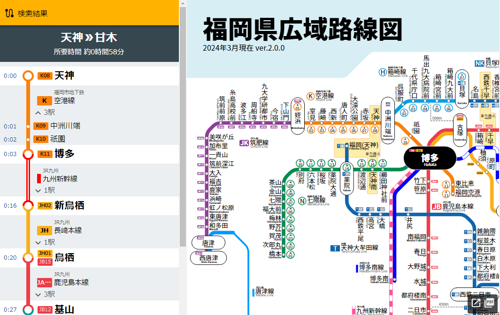
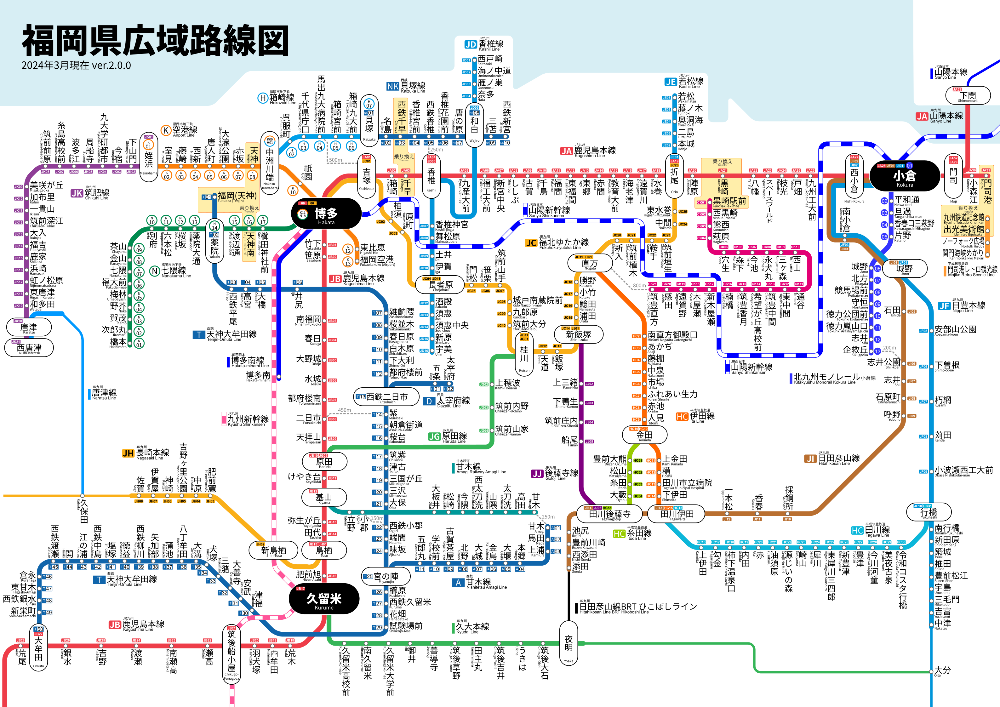

# 福岡県近郊 鉄道乗換案内

福岡県近郊の路線データに基づき、乗換案内をするWebアプリです。

経路はサーバー側でダイクストラ法を用いて計算します。

所要時間データは独自で作成したものを使用しており、正確な時刻表に基づいて算出するわけではないため、
所要時間はあくまで目安です。

## 技術仕様

+ フレームワーク: Nuxt.js (Nuxt3)
+ バックエンド: Netlify Functions (AWS LambdaをNetlify用にラップしたサービス)
    + 開発言語: TypeScript
+ ホスティングサービス: Netlify

## ディレクトリ構成
+ `netlify/`: サーバーサイドの実装
    + `route-db/`: 検索用に駅一覧と路線一覧を返すAPI
    + `search_route/`: ルート探索本体およびAPI
+ `pages`: フロント側のページ
+ `components`: フロント側のVue.jsのコンポーネント

その他構成は、一般的なNuxt3のディレクトリ構成に従っていると思います。

## 対応エリア

以下の路線図に示すエリア内の検索に対応しています(細い線の路線を除く)。

また、一部の駅間の徒歩連絡ルートも収録しています。

